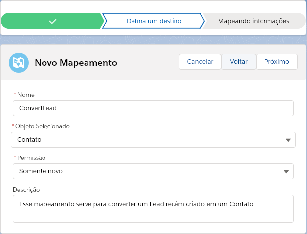

Criando o Mapeamento
====================

A segunda etapa para utilizarmos a biblioteca é vincular a origem criada 
anteriormente com campos de um Objeto do Salesforce, gerando assim um 
registro de :doc:`Mapeamento </Tecnico/ObjetosPersonalizados/mapeamento>` 
e os registros de :doc:`Campo do Mapeamento </Tecnico/ObjetosPersonalizados/campoMapeamento>`, 
no exemplo a seguir utilizaremos a origem criada anteriormente :doc:`aqui </Exemplo/comecandoMetadados>`, 
para criar um novo **Contato** a partir dos campos da origem de um objeto **Lead**.

.. Hint:: As etapas 1 e 2, podem ser feitas implantando os nossos componentes lightning LWC :doc:`inMapMappingList </Tecnico/LightningWebComponents/inMapMappingList>` ou :doc:`inMapMappingBuilder </Tecnico/LightningWebComponents/inMapMappingBuilder>`, nesse caso não é necessário ter um :doc:`domínio </FAQ/dominio>` registrado, caso queira utilizar a aplicação e as guias da nossa blibioteca terá que ter um :doc:`domínio </FAQ/dominio>` para sua organização.

Agora iniciaremos a criação do mapeamento: 

1- Vá até o aplicativo de **Biblioteca de Mapeamento**:

.. figure:: img/biblioteca.png
    :alt: Solidity logo
    :align: center
    
    Selecionando o aplicativo **Biblioteca de Mapeamento**.

2- Após isso vá na aba de **Gerenciador de Mapeamentos** e clique em **Novo**:

.. figure:: img/gerenciadorMapeamentos.png
    :alt: Solidity logo
    :align: center
    
    Aba **Gerenciador de Mapeamentos** da **Biblioteca de Mapeamento**.

.. Hint:: As etapas 1 e 2, podem ser feitas implantando os nossos componentes lightning LWC :doc:`inMapMappingList </Tecnico/LightningWebComponents/inMapMappingList>` ou :doc:`inMapMappingBuilder </Tecnico/LightningWebComponents/inMapMappingBuilder>`, nesse caso não é necessário instalar o domínio.

3- Agora selecione **LeadToContact**:

.. figure:: img/step1.png
    :alt: Solidity logo
    :align: center
    
    Selecionando a origem **LeadToContact**.

A segunda etapa será a configuração o destino do mapeamento da seguinte forma:

*   **Nome**: ConvertLead
*   **Objeto Selecionado**: Contato
*   **Permissão**: Somente novo
*   **Descrição**: Esse mapeamento serve para converter um Lead recém criado em um Contato.

1- Como demonstrado na figura a seguir:

    
    Configurando o destino do mapeamento.

A terceira e última etapa será a parte de fazer o mapeamento dos :doc:`Campos de Origem </Tecnico/Metadados/campoOrigem>` para os campos do destino,

1- O :doc:`Campo de Origem </Tecnico/Metadados/campoOrigem>` **ExemploCompany** será convertido para o campo do Contato **Descrição do contato**

2- O :doc:`Campo de Origem </Tecnico/Metadados/campoOrigem>` **ExemploName** será convertido para o campo do Contato **Sobrenome**

Como podemos ver na figura a seguir:

.. figure:: img/step3.png
    :alt: Solidity logo
    :align: center
    
    Mapenando os campos da origem para os campos do destino.

Após finalizar a será criado um registro no objeto :doc:`Mapeamento </Tecnico/ObjetosPersonalizados/mapeamento>` e os devidos registro dos :doc:`Campos de Mapeamento </Tecnico/ObjetosPersonalizados/campoMapeamento>`.