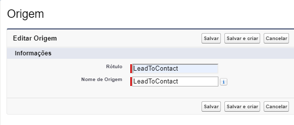
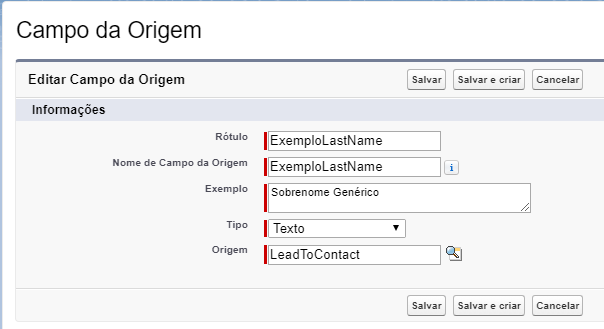
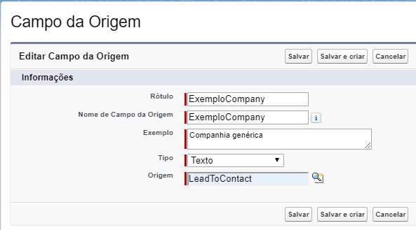

Criando sua Origem
==================

A primeira etapa para utilizarmos a biblioteca é ter uma 
origem e seus campos criados, no exemplo a seguir criaremos 
uma :doc:`Origem </Tecnico/Metadados/origem>`, baseada no objeto 
**Lead** do Salesforce, além disso mapearemos os campos **Sobrenome** 
e o campo **Companhia**.

O primeiro passo será criar a origem, nisso acessando os metadados criaremos um registro no metadado :doc:`Origem </Tecnico/Metadados/origem>`, nesse caso estamos criando uma origem do que seria o objeto padrão do Salesforce a **Lead**, conforme a figura a seguir:

    
    Criando um registro de **Origem** chamado LeadToContact.

Após criada a origem, teremos que criar os campos que serão utilizados para o mapeamento, nesse caso vamos utilizar os campos **Sobrenome** e **Companhia** do objeto **Lead**, como vemos a seguir:

1- Campo **Sobrenome**:

    
    Criando um registro de **Campo de Origem** chamado ExemploLastName do tipo **Texto**.

2- Campo **Companhia**:

    
    Criando um registro de **Campo de Origem** chamado ExemploCompany do tipo **Texto**.