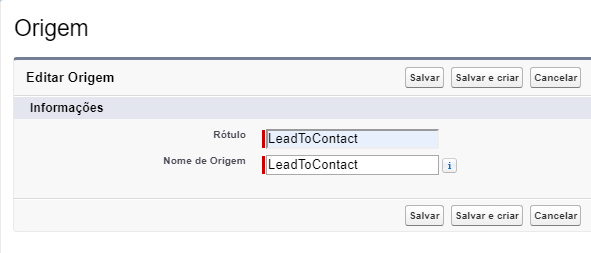
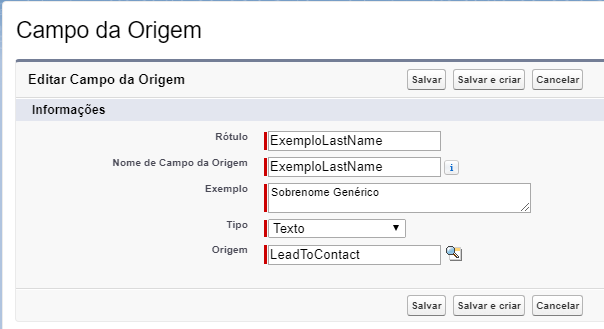
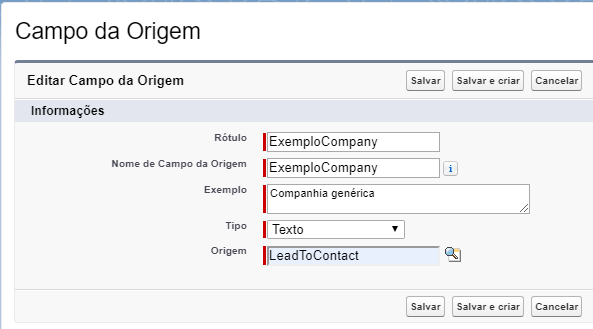
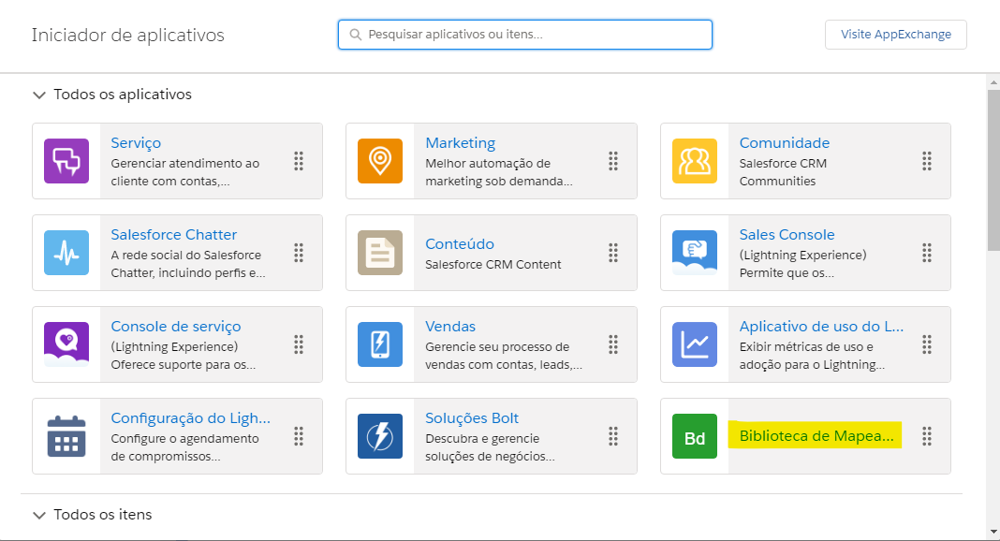
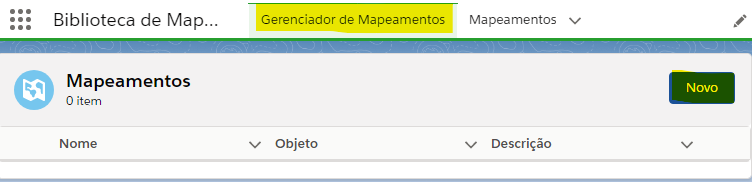
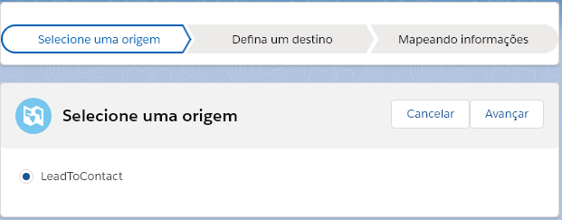
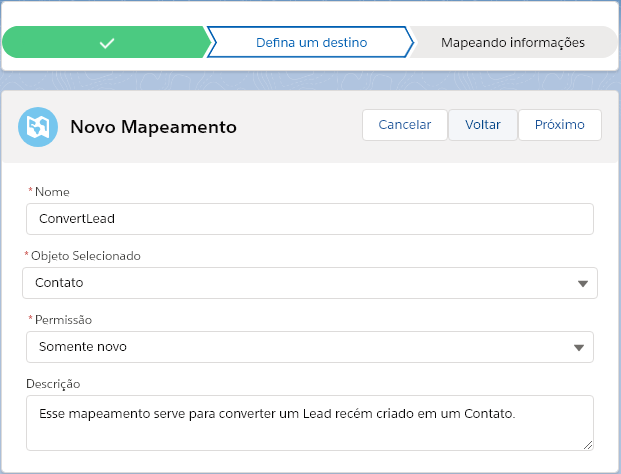
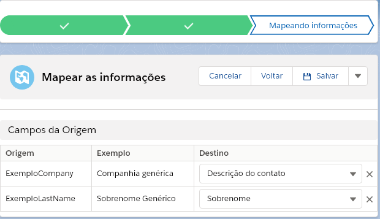

Começando (Getting Started)
===========================

Após a importação do pacote, será demonstrado um exemplo de como pode 
utilizar a biblioteca, nesse exemplo será criado um Contato a partir 
da inserção de um Lead, utilizando a nossa bilbioteca que vem com a 
biblioteca, para poder utilizar-la de forma corretamente, antes de 
importar o pacote será necessário que a organização tenha um 
:doc:`domínio </FAQ/dominio>` registrado.

**Criação dos metadado**

Crie um registro no metadado :doc:`Origem </Tecnico/Metadados/origem>`, conforme a figura a seguir:

    
    Criando um registro de **Origem** chamado LeadToContact.

Crie os registros no metadado :doc:`Campo de Origem </Tecnico/Metadados/campoOrigem>` 
para a conversão do **Lead** para um **Contato**, nesse exemplo teremos dois campos que 
serão passados para o **Contato**:

1- Campo **Sobrenome**:

    
    Criando um registro de **Campo de Origem** chamado ExemploLastName do tipo **Texto**.

2- Campo **Companhia**:

    
    Criando um registro de **Campo de Origem** chamado ExemploCompany do tipo **Texto**.

**Criação do mapeamento**

Agora será criado o mapeamento: 

1- Vá até o aplicativo de **Biblioteca de Mapeamento**:

    
    Selecionando o aplicativo **Biblioteca de Mapeamento**.

2- Após isso vá na aba de **Gerenciador de Mapeamentos** e clique em **Novo**:

    
    Aba **Gerenciador de Mapeamentos** da **Biblioteca de Mapeamento**.

.. Hint:: As etapas 1 e 2, podem ser feitas implantando os nossos componentes lightning LWC :doc:`inMapMappingList </Tecnico/LightningWebComponents/inMapMappingList>` ou :doc:`inMapMappingBuilder </Tecnico/LightningWebComponents/inMapMappingBuilder>`, nesse caso não é necessário instalar o domínio.

3- Agora selecione **LeadToContact**:

    
    Selecionando a origem **LeadToContact**.

A segunda etapa será a configuração o destino do mapeamento da seguinte forma:

*   **Nome**: ConvertLead
*   **Objeto Selecionado**: Contato
*   **Permissão**: Somente novo
*   **Descrição**: Esse mapeamento serve para converter um Lead recém criado em um Contato.

Como demonstrado na figura a seguir:

    
    Configurando o destino do mapeamento.

A terceira e última etapa será a parte de fazer o mapeamento dos :doc:`Campos de Origem </Tecnico/Metadados/campoOrigem>` para os campos do destino,

1- O :doc:`Campo de Origem </Tecnico/Metadados/campoOrigem>` **ExemploCompany** será convertido para o campo do Contato **Descrição do contato**

2- O :doc:`Campo de Origem </Tecnico/Metadados/campoOrigem>` **ExemploName** será convertido para o campo do Contato **Sobrenome**

Como podemos ver na figura a seguir:

    
    Mapenando os campos da origem para os campos do destino.

Após finalizar a será criado um registro no objeto :doc:`Mapeamento </Tecnico/ObjetosPersonalizados/mapeamento>` e os devidos registro dos :doc:`Campos de Mapeamento </Tecnico/ObjetosPersonalizados/campoMapeamento>`.

**Criação do trigger**

Após toda essas etapas, agora iremos criar um trigger de after insert para o objeto Lead, nesse momento será mostrado uma forma da converção dos dados utilizando a classe :doc:`InMapEngine </Tecnico/Classes/map_engine>` e suas *Inner Class* :doc:`EngineOptions </Tecnico/Classes/engine_options>` e :doc:`MapEntity </Tecnico/Classes/map_entity>`, como desmonstrado a seguir:

.. code-block:: apex
	:linenos:

	
	trigger lead_ai on Lead (after insert) {
		List<Lead> lstLead = Trigger.new;
	    
		Set<Id> setIdMaps = new Set<Id>();
		
		// 	Pegando o Id do mapeamento criado
		Mapeamento__c maps = [
	            SELECT 
	                Id,
	                Name
	            FROM 
	                Mapeamento__c
	            WHERE
	                Name = 'ConvertLead'
	    ]; 
	    setIdMaps.add(maps.Id);
	    
	    
	    // Criando o objeto EngineOptions e atribuindo o Id do mapeamento que utilizaremos
	    InMapEngine.EngineOptions engineOpt = new InMapEngine.EngineOptions();
	    engineOpt.setMapeamentoId = setIdMaps;
	    
	    
	    
	    // Criando o Map, para realização do parse, onde o a chave do map é o nome do campo da origem e o objeto do map é o valor desse campo no objeto destino
	    List<Map<String, Object>> oLead = new List<Map<String, Object>>();
	    Map<String, Object> mapCampos = new Map<String, Object>();
	    for(Integer i = 0; i < lstLead.size(); i++) {
	        mapCampos.clear();
	        mapCampos.put('ExemploLastName', lstLead[i].LastName);
	        mapCampos.put('ExemploCompany', lstLead[i].Company);
	        oLead.add(mapCampos);
	    }
	    
	    
	    // E por último iniciando a engrenagem de mapear os dados passados
	    InMapEngine.doItByOptions(engineOpt, oLead);
	}