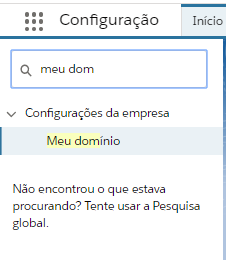

Registro de Domínio para a Organização
--------------------------------------

Para utilizar um componente lightning como guia no SalesForce será necessário registrar um domínio.
Para cadastrar um domínio, vá até às configurações através a engrenagem no canto superior direito, como na figura a seguir: 

.. figure:: img/configuracao.png
    :alt: Solidity logo
    :width: 500px
    :align: center
    
    Acessando **Configurações** da organização.

A seguir digite na barra de busca rápida **Meu domínio** e clique nele, como na figura a seguir:

    
    Barra de pesquisa das configurações

Caso não tenha domínio cadastrado, deve-se escolher um nome para o domínio e verificar a validade do mesmo.

    
    Registro de domínio

Após a validação confirmada, registrar o domínio do mesmo. Após o registro concluído, o SalesForce pedirá para que logue novamente. 

Após logar, vá para a tela do **Meu domínio** novamente e clique em **Efetuar login**.

.. figure:: img/dominio3.png
    :align: center

    Logar no novo domínio

Efetuado login, clique em **Implantar para usuários**.

.. figure:: img/dominio4.png
    :alt: Solidity logo
    :align: center
    
    Implantar o novo domínio para os usuários

Tendo realizado estas ações, já com o domínio registrado, poderá seguir para a instalação do pacote.