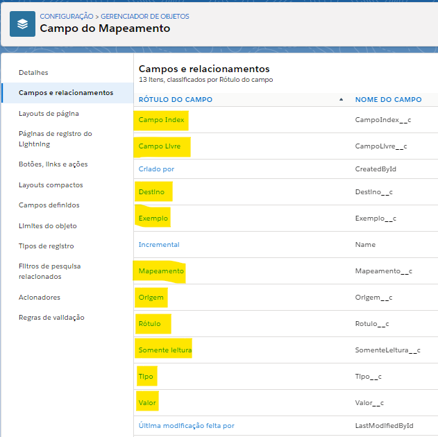

Registro de Domínio para a Organização
--------------------------------------

Para que o pacote possa ser baixado primariamente o usuário deve possuir uma organização no SalesForce que possua o domínio cadastrado. Para cadastrar um domínio, vá até às configurações através a engrenagem no canto superior direito, como na figura a seguir: 

.. figure:: img/configuracao.png
    :alt: Solidity logo
    :width: 500px
    :align: center
    
    Acessando **Configurações** da organização.

A seguir digite na barra de busca rápida **Meu domínio** e clique nele, como na figura a seguir:

.. figure:: img/dominio1.png
    :alt: Solidity logo
    :align: center
    
    Barra de pesquisa das configurações

Caso não tenha domínio cadastrado, deve-se escolher um nome para o domínio e verificar a validade do mesmo.

.. figure:: img/dominio2.png
    :alt: Solidity logo
    :align: center
    
    Registro de domínio

Após a validação confirmada, registrar o domínio do mesmo. Após o registro concluído, o SalesForce pedirá para que logue novamente. 

Após logar, vá para a tela do **Meu domínio** novamente e clique em **Efetuar login**.

.. figure:: img/dominio3.png
    :align: center

    Logar no novo domínio

Efetuado login, clique em **Implantar para usuários**.

.. figure:: img/dominio4.png
    :alt: Solidity logo
    :align: center
    
    Implantar o novo domínio para os usuários

Tendo realizado estas ações, já com o domínio registrado, poderá seguir para a instalação do pacote.

Implantação da Biblioteca
-------------------------------

Com o arquivo .Zip da biblioteca será necessário fazer o deploy via Workbentch, acessando o site a seguir:
        
        https://workbench.developerforce.com/login.php

Após fazer o login vá até o canto superior direito em **Migration -> Deploy**, como demonstrado na figura a seguir:

    
    Acessando a seção para fazer o deploy

Agora escolha o .Zip da biblioteca e marque **Single Package**, como na figura a seguir:

    
    Configurando o deploy

Na tela a seguir clique em **Deploy**.

    
    Confirmando o deploy

Nesse momento será iniciado o deploy, caso ocorra tudo certo, sem nenhum problema, ficará parecido como a figura a seguir:

    
    Deploy finalizado

Configuração pós importação
-------------------------------

Após a importação do pacote será necessário configurar os perfis 
que terão acesso aos aplicativos da biblioteca, na biblioteca 
temos dois aplicativos um para o lightning e outro para o
classic.

Para acessa-los será necessário ir até configuração, como na figura a seguir: 

.. figure:: img/configuracao.png
    :alt: Solidity logo
    :width: 500px
    :align: center
    
    Acessando **Configurações** da organização.

A seguir digite na barra de busca rápida **Gerente de aplicativo** e clique nele, como na figura a seguir:

    
    Barra de pesquisa das configurações.

Nele teremos os dois aplicativos citados anteriormente, como na figura a seguir:

    
    Aplicativos da **Biblioteca de Mapeamento**.

Edite o aplicativo da sua escolha (caso sua organização seja em lightning de preferença utilize o lightning, mas pode habilitar o acesso para ambos aplicativos), agora na tela de edição vá até a aba lateral chamada **Perfis de usuário** e selecione os perfis que terão acesso a esse aplicativo, como demonstrado na figura a seguir:

    
    Perfis que terão acesso ao aplicativo.

Após selecionar os perfis para o aplicativo, aperte em **Salvar**.

**Habilidando as guias personalizadas**

Agora será necessário habilitar as guias personalizadas para os 
úsuarios que utilizarão o aplicativo.

Para habilitar a guia será necessário ir até configuração, como na figura a seguir: 

.. figure:: img/configuracao.png
    :alt: Solidity logo
    :width: 500px
    :align: center
    
    Acessando **Configurações** da organização.

A seguir digite na barra de busca rápida **Perfis** e clique nele, como na figura a seguir:

.. figure:: img/perfis.png
    :alt: Solidity logo
    :align: center
    
    Barra de pesquisa das configurações.

A seguir clique em **Editar** no perfil que utilizará o aplicativo e ative as guias personalizadas, como na figura a seguir:

    
    Ativando as guias personalizadas.

.. Hint:: Caso mais do que um usuário utilize o aplicativo, terá que ativar as guias para esses usuários.

**Habilidando os campos personalizados**

Agora será necessário habilitar os campos personalizados 
do objeto **Mapeamento** e no objeto **Campo do Mapeamento** 
para os úsuarios que utilizarão o aplicativo.

Para editar um campo um campo de mapeamento precisa ir até configuração, como na figura a seguir: 

.. figure:: img/configuracao.png
    :alt: Solidity logo
    :width: 500px
    :align: center
    
    Acessando **Configurações** da organização.

Após vá na aba **Gerenciador de objetos** e clique no objeto **Mapeamento**, como na figura a seguir:

    
    Acessando o objeto personalizado **Mapeamento**.

Após isso vá na aba **Campos e relacionamentos** e clique em cima do rótulo do campo, no caso da figura a seguir seria o campo **Descrição**:

    
    Acessando o campo personalizado **Descrição**.

Agora clique no botão **Definir segurança no nível do campo**, como na figura a seguir:

.. figure:: img/definirSeguranca.png
    :alt: Solidity logo
    :width: 500px
    :align: center
    
    Acessando nível de segurança do campo.

Agora altere a visibilidade de acordo a sua necessidade e clique em **Salvar**, na figura a seguir é visível para todos:

    
    Deixando o campo visível para todos.

Será necessário fazer esse mesmo processo para os seguintes campos do objeto **Mapeamento** e **Campo do Mapeamento**
    
**Mapeamento**

*   Descrição
*   Objeto
*   Origem
*   Parent Id
*   Permissão

    
    Campos que precisam de premissão no objeto **Mapemaento**.

**Campo do Mapeamento**

*   Campo Index
*   Campo Livre
*   Destino
*   Exemplo
*   Mapeamento
*   Origem
*   Rótulo
*   Somente leitura
*   Tipo
*   Valor

    
    Campos que precisam de premissão no objeto **Campo do Mapemaento**.
